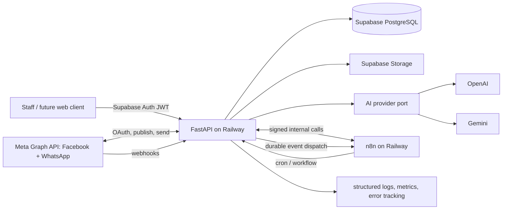
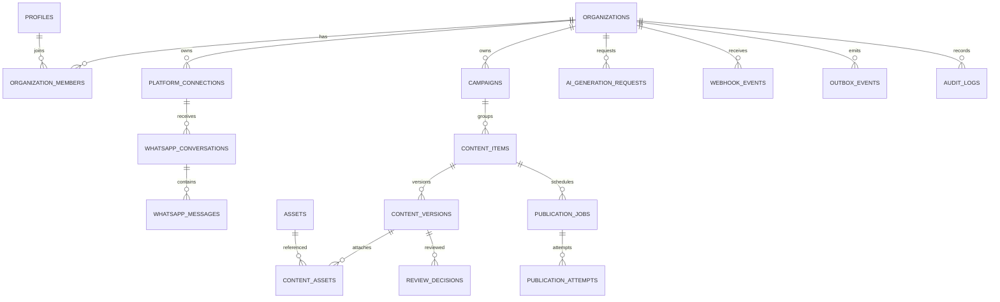

# NIGHT CLUB AI v1.0 - Technical Blueprint

**Status:** Planning only - implementation is prohibited pending explicit approval.

## 1. Scope and boundaries

Night Club AI is an independently deployable platform that creates, reviews, schedules, publishes, and audits nightclub social content. Version 1.0 supports Facebook Pages and WhatsApp Business Platform. Instagram is deliberately excluded from the v1.0 runtime, API surface, OAuth scopes, and delivery plan.

This system has no repository, credential, deployment, database, service, network, or runtime dependency on **La Boutique**. It uses its own GitHub repository, Supabase project, Railway services, Meta application, n8n instance, AI-provider keys, domains, and secret values.

### MVP user outcomes

1. An authorized staff member creates a campaign and content draft.
2. AI proposes copy from a controlled brief; a human edits it.
3. A reviewer approves or rejects the exact content version.
4. Approved content is scheduled and published to a connected Facebook Page.
5. WhatsApp Business webhooks are received, verified, retained, and auditable; outbound WhatsApp sends use approved templates or explicit operator action.
6. n8n orchestrates timers and non-business workflows through authenticated FastAPI calls.

## 2. Architecture diagram



### Ownership boundaries

| Component | Owns | Must not own |
|---|---|---|
| FastAPI | Domain rules, authorization, state transitions, provider adapters, audit writes | Cron policy or visual workflow logic |
| n8n | Cron triggers, retries/orchestration, notifications, low-code operational workflows | Business rules, tokens, direct database mutation |
| Supabase PostgreSQL | Durable application state and transactional outbox | Orchestration decisions |
| Supabase Storage | Original media and controlled delivery URLs | Authorization decisions outside signed URLs |
| Meta APIs | Page publication and WhatsApp delivery | Application source of truth |
| AI providers | Generation only | Publishing, permissions, campaign state |

## 3. Component architecture

Use a modular monolith, not microservices. FastAPI modules communicate through application services and repository interfaces inside one deployable service.

| Layer / module | Responsibilities |
|---|---|
| `api` | HTTP routes, validation, response mapping, dependency injection, OpenAPI |
| `identity` | JWT validation, membership lookup, RBAC |
| `campaigns` | Campaign lifecycle and content grouping |
| `content` | Draft/version lifecycle, approvals, schedules, publication state |
| `assets` | Media metadata, signed uploads/downloads, storage-key policy |
| `ai` | Provider-neutral generation port, prompt templates, guardrails, cost/usage records |
| `integrations.meta` | OAuth, encrypted credentials, Facebook publishing, WhatsApp send/webhook adapters |
| `automation` | Outbox, n8n commands/events, job leasing and retry rules |
| `webhooks` | Meta verification, signature validation, inbox persistence, duplicate handling |
| `audit` | Immutable actor/action/event records |
| `platform` | Database, configuration, encryption, observability, error translation |

No route, n8n workflow, or provider adapter may write domain tables directly except through the relevant application service.

## 4. Proposed repository structure

```text
nightclub-ai/
  docs/
    ARCHITECTURE_BLUEPRINT.md
    adr/
    runbooks/
  backend/
    app/
      api/v1/
      core/
      modules/
        identity/ campaigns/ content/ assets/ ai/ integrations/ automation/ webhooks/ audit/
      shared/
    migrations/
    tests/
      unit/ integration/ contract/ e2e/
    pyproject.toml
    Dockerfile
  n8n/
    workflows/                 # exported, reviewed workflow JSON; never secrets
    README.md
  infra/
    railway/                   # deployment templates only after approval
    supabase/                  # SQL migrations/storage policies after approval
  .github/workflows/
  .env.example
  README.md
  AGENTS.md
```

## 5. Data model and ERD

All application identifiers are UUIDs. All timestamps are `timestamptz` in UTC. Business display time uses the organization IANA timezone (default `America/Mexico_City`). Tables have `created_at` and `updated_at` unless noted; `updated_at` is database-maintained.



### 5.1 Enumerations

| Enum | Values |
|---|---|
| member_role | `owner`, `manager`, `editor`, `reviewer`, `operator`, `viewer` |
| platform | `facebook`, `whatsapp`, `instagram` (reserved only; no v1 behavior) |
| connection_status | `active`, `expired`, `revoked`, `error`, `pending` |
| campaign_status | `draft`, `active`, `paused`, `completed`, `archived` |
| content_status | `draft`, `in_review`, `changes_requested`, `approved`, `scheduled`, `publishing`, `published`, `failed`, `cancelled` |
| asset_kind | `image`, `video`, `document` |
| publication_status | `pending`, `leased`, `publishing`, `succeeded`, `retryable_failure`, `permanent_failure`, `cancelled` |
| webhook_status | `received`, `processed`, `ignored`, `failed` |
| outbox_status | `pending`, `leased`, `delivered`, `retryable_failure`, `dead_letter` |
| ai_status | `queued`, `running`, `succeeded`, `failed`, `cancelled` |
| whatsapp_direction | `inbound`, `outbound` |

### 5.2 Complete schema

| Table | Columns and constraints |
|---|---|
| `organizations` | `id uuid PK`; `name text not null`; `slug citext unique not null`; `timezone text not null default 'America/Mexico_City'`; `is_active boolean not null default true` |
| `profiles` | `id uuid PK FK auth.users(id)`; `display_name text`; `email citext unique`; `is_active boolean not null default true`; `last_seen_at timestamptz` |
| `organization_members` | `organization_id uuid FK organizations`; `user_id uuid FK profiles`; `role member_role not null`; `created_by uuid FK profiles`; `PK(organization_id,user_id)`; index `(user_id,organization_id)` |
| `platform_connections` | `id uuid PK`; `organization_id uuid not null FK`; `platform platform not null`; `external_account_id text not null`; `display_name text not null`; `capabilities jsonb not null default '{}'`; `credentials_ciphertext bytea not null`; `credential_key_version smallint not null`; `token_expires_at timestamptz`; `status connection_status not null`; `last_verified_at timestamptz`; `last_error_code text`; `last_error_at timestamptz`; unique `(organization_id,platform,external_account_id)`; index `(organization_id,platform,status)` |
| `campaigns` | `id uuid PK`; `organization_id uuid not null FK`; `name text not null`; `objective text`; `brief jsonb not null default '{}'`; `starts_at timestamptz`; `ends_at timestamptz`; `status campaign_status not null default 'draft'`; `created_by uuid not null FK`; check `ends_at is null or starts_at is null or ends_at >= starts_at`; index `(organization_id,status,starts_at)` |
| `assets` | `id uuid PK`; `organization_id uuid not null FK`; `storage_bucket text not null`; `storage_key text unique not null`; `kind asset_kind not null`; `mime_type text not null`; `byte_size bigint not null check (byte_size > 0)`; `sha256 char(64) not null`; `original_filename text`; `width integer`; `height integer`; `duration_ms integer`; `status text not null check (status in ('pending','ready','rejected','deleted'))`; `uploaded_by uuid not null FK`; unique `(organization_id,sha256)`; index `(organization_id,status)` |
| `content_items` | `id uuid PK`; `organization_id uuid not null FK`; `campaign_id uuid FK campaigns`; `platform platform not null check (platform in ('facebook','whatsapp'))`; `connection_id uuid FK platform_connections`; `status content_status not null default 'draft'`; `current_version_no integer not null default 1`; `approved_version_no integer`; `scheduled_for timestamptz`; `published_at timestamptz`; `external_post_id text`; `last_error_code text`; `last_error_message text`; `created_by uuid not null FK`; check `approved_version_no is null or approved_version_no <= current_version_no`; index `(organization_id,status,scheduled_for)` |
| `content_versions` | `id uuid PK`; `content_item_id uuid not null FK content_items on delete cascade`; `version_no integer not null`; `body text not null`; `title text`; `link_url text`; `payload jsonb not null default '{}'`; `source text not null check (source in ('manual','ai','import'))`; `ai_generation_id uuid nullable`; `created_by uuid not null FK`; unique `(content_item_id,version_no)` |
| `content_assets` | `content_version_id uuid FK content_versions on delete cascade`; `asset_id uuid FK assets`; `position smallint not null default 0`; `PK(content_version_id,asset_id)`; unique `(content_version_id,position)` |
| `review_decisions` | `id uuid PK`; `content_item_id uuid not null FK`; `content_version_id uuid not null FK`; `decision text not null check (decision in ('approved','changes_requested'))`; `comment text`; `decided_by uuid not null FK`; `decided_at timestamptz not null default now()`; index `(content_item_id,decided_at desc)` |
| `publication_jobs` | `id uuid PK`; `content_item_id uuid not null FK`; `content_version_id uuid not null FK`; `idempotency_key uuid not null unique`; `scheduled_for timestamptz not null`; `status publication_status not null default 'pending'`; `attempt_count smallint not null default 0`; `lease_token uuid`; `lease_expires_at timestamptz`; `published_external_id text`; `next_attempt_at timestamptz`; `created_by uuid not null FK`; unique `(content_item_id,status)` where status in (`pending`,`leased`,`publishing`) |
| `publication_attempts` | `id uuid PK`; `publication_job_id uuid not null FK`; `attempt_no smallint not null`; `started_at timestamptz not null`; `finished_at timestamptz`; `request_fingerprint char(64) not null`; `provider_request_id text`; `provider_response jsonb`; `outcome text not null check (outcome in ('succeeded','retryable_failure','permanent_failure'))`; `error_code text`; `error_message text`; unique `(publication_job_id,attempt_no)` |
| `ai_generation_requests` | `id uuid PK`; `organization_id uuid not null FK`; `content_item_id uuid FK`; `provider text not null`; `model text not null`; `prompt_template_key text not null`; `prompt_template_version integer not null`; `input_redacted jsonb not null`; `output jsonb`; `provider_request_id text`; `input_tokens integer`; `output_tokens integer`; `estimated_cost_usd numeric(12,6)`; `status ai_status not null`; `error_code text`; `created_by uuid not null FK`; index `(organization_id,created_at desc)` |
| `webhook_events` | `id uuid PK`; `organization_id uuid nullable FK`; `source text not null check (source in ('meta'))`; `event_key text not null`; `headers jsonb not null`; `payload jsonb not null`; `payload_sha256 char(64) not null`; `received_at timestamptz not null default now()`; `status webhook_status not null default 'received'`; `processed_at timestamptz`; `error_code text`; unique `(source,event_key)`; unique `(source,payload_sha256)` |
| `whatsapp_conversations` | `id uuid PK`; `organization_id uuid not null FK`; `connection_id uuid not null FK`; `wa_id text not null`; `contact_name text`; `last_message_at timestamptz`; `status text not null default 'open'`; unique `(connection_id,wa_id)` |
| `whatsapp_messages` | `id uuid PK`; `conversation_id uuid not null FK`; `direction whatsapp_direction not null`; `meta_message_id text unique`; `message_type text not null`; `body jsonb not null`; `delivery_status text`; `sent_by uuid FK`; `sent_at timestamptz`; `received_at timestamptz`; index `(conversation_id,received_at desc)` |
| `outbox_events` | `id uuid PK`; `organization_id uuid FK`; `aggregate_type text not null`; `aggregate_id uuid not null`; `event_type text not null`; `payload jsonb not null`; `idempotency_key uuid not null unique`; `status outbox_status not null default 'pending'`; `attempt_count smallint not null default 0`; `available_at timestamptz not null default now()`; `lease_token uuid`; `lease_expires_at timestamptz`; `delivered_at timestamptz`; `last_error text`; index `(status,available_at)` |
| `automation_runs` | `id uuid PK`; `outbox_event_id uuid FK`; `workflow_name text not null`; `n8n_execution_id text`; `status text not null check (status in ('started','succeeded','failed'))`; `started_at timestamptz not null`; `finished_at timestamptz`; `details jsonb not null default '{}'`; unique `(workflow_name,n8n_execution_id)` |
| `idempotency_keys` | `key uuid PK`; `organization_id uuid FK`; `actor_id uuid FK`; `operation text not null`; `request_hash char(64) not null`; `response_status integer`; `response_body jsonb`; `state text not null check (state in ('in_progress','completed','failed'))`; `expires_at timestamptz not null`; index `(expires_at)` |
| `audit_logs` | `id bigint generated always as identity PK`; `organization_id uuid FK`; `actor_type text not null check (actor_type in ('user','system','n8n','meta'))`; `actor_id text`; `action text not null`; `entity_type text not null`; `entity_id uuid`; `correlation_id uuid`; `ip inet`; `user_agent text`; `before jsonb`; `after jsonb`; `created_at timestamptz not null default now()`; index `(organization_id,created_at desc)` |

Foreign keys default to `RESTRICT`; only content version children cascade. Store external responses only after redaction. Add a retention job for expired idempotency keys, webhook raw payloads, and stale pending assets.

## 6. API design and contracts

Base URL: `/api/v1`. JSON uses camelCase. Success responses carry `data` and `meta`; errors use RFC 9457-style problem documents. All mutating public requests require `Idempotency-Key: <UUID>`.

### 6.1 Endpoint specification

| Method / path | Authorization | Purpose |
|---|---|---|
| `GET /health/live`, `GET /health/ready` | public / internal | Liveness and dependency readiness |
| `GET /me` | member | Current identity, organizations, roles |
| `GET,POST /campaigns` | viewer / editor | List or create campaigns |
| `GET,PATCH /campaigns/{id}` | viewer / editor | Read or edit campaign |
| `POST /campaigns/{id}/archive` | manager | Archive campaign |
| `GET,POST /content` | viewer / editor | List or create a draft |
| `GET,PATCH /content/{id}` | viewer / editor | Read or edit current draft; editing an approved item creates a new version and returns it to draft |
| `POST /content/{id}/submit-review` | editor | Move draft to `in_review` |
| `POST /content/{id}/review` | reviewer | Approve or request changes for the current version |
| `POST /content/{id}/schedule` | manager | Schedule an approved version |
| `POST /content/{id}/cancel-schedule` | manager | Cancel a pending schedule |
| `POST /content/{id}/publish-now` | manager | Create immediate publication job; still asynchronous |
| `POST /ai/generations` | editor | Generate proposed copy; never publishes |
| `POST /assets/upload-url` | editor | Issue a short-lived signed upload URL and asset intent |
| `POST /assets/{id}/complete` | editor | Verify stored object and make asset available |
| `GET /assets/{id}/download-url` | viewer | Issue short-lived signed read URL |
| `GET /connections` | manager | List redacted integration health |
| `POST /connections/facebook/oauth/start` | manager | Initiate Meta OAuth state transaction |
| `GET /connections/facebook/oauth/callback` | state validated | Exchange code, select Page/WABA, persist encrypted credential |
| `POST /whatsapp/messages` | operator | Send approved template or authorized free-form reply |
| `GET /whatsapp/conversations`, `GET /whatsapp/conversations/{id}/messages` | operator | Read retained WhatsApp conversations |
| `GET,POST /webhooks/meta` | Meta only | Verification and inbound events |
| `POST /internal/automation/publish-due` | n8n only | Lease due jobs and request FastAPI publication |
| `POST /internal/automation/outbox/{id}/ack` | n8n only | Acknowledge event delivery |

### 6.2 Key request and response contracts

**Create content**

```json
POST /api/v1/content
{
  "campaignId": "uuid",
  "platform": "facebook",
  "connectionId": "uuid",
  "body": "Tonight: live DJ set at 11 PM.",
  "assetIds": ["uuid"]
}
```

```json
201
{
  "data": {
    "id": "uuid", "status": "draft", "currentVersionNo": 1,
    "platform": "facebook", "body": "Tonight: live DJ set at 11 PM.",
    "assetIds": ["uuid"], "createdAt": "2026-09-02T00:00:00Z"
  }
}
```

**Generate content**

```json
POST /api/v1/ai/generations
{
  "contentId": "uuid",
  "provider": "openai",
  "template": "facebook_event_v1",
  "brief": {"eventName": "Neon Friday", "tone": "energetic", "language": "es-MX"}
}
```

```json
202
{
  "data": {
    "generationId": "uuid", "status": "queued",
    "contentId": "uuid"
  }
}
```

**Review a version**

```json
POST /api/v1/content/{id}/review
{"versionNo": 2, "decision": "approved", "comment": "Ready for Friday."}
```

```json
200
{"data":{"id":"uuid","status":"approved","approvedVersionNo":2}}
```

**Schedule**

```json
POST /api/v1/content/{id}/schedule
{"versionNo":2,"scheduledFor":"2026-09-05T04:00:00Z"}
```

```json
202
{"data":{"contentId":"uuid","status":"scheduled","publicationJobId":"uuid","scheduledFor":"2026-09-05T04:00:00Z"}}
```

**Asset intent**

```json
POST /api/v1/assets/upload-url
{"filename":"flyer.png","mimeType":"image/png","byteSize":240011,"sha256":"64-char-hex"}
```

```json
201
{"data":{"assetId":"uuid","uploadUrl":"https://...","expiresAt":"...","storageKey":"org/uuid/assets/uuid"}}
```

**Error contract**

```json
{
  "type": "https://nightclub-ai/errors/invalid-transition",
  "title": "Invalid content state transition",
  "status": 409,
  "code": "CONTENT_NOT_APPROVED",
  "detail": "Only the approved version may be scheduled.",
  "correlationId": "uuid"
}
```

Pagination uses cursor fields: `?limit=50&cursor=<opaque>&status=scheduled`. List responses return `meta.nextCursor`. Dates are ISO-8601 UTC. Client supplied platform names are limited to `facebook` and `whatsapp` in v1 despite the reserved database enum.

## 7. Authentication and authorization

### Authentication

1. Supabase Auth is the only human identity provider in v1 (email/password or magic link; MFA for privileged roles before production launch).
2. The future Next.js client obtains a Supabase JWT and sends `Authorization: Bearer <jwt>` to FastAPI.
3. FastAPI validates issuer, audience, expiration, signature, and JWKS key; it does not trust unsigned client claims.
4. FastAPI resolves active membership from `organization_members` on every request or a short TTL cache. Organization context comes from an explicit `X-Organization-Id` validated against membership, never only from the token.
5. n8n uses a separate rotating `N8N_INTERNAL_SECRET` plus timestamped HMAC signature. Meta uses its challenge verifier and `X-Hub-Signature-256` HMAC verification.

### Authorization (RBAC)

| Capability | owner | manager | editor | reviewer | operator | viewer |
|---|---:|---:|---:|---:|---:|---:|
| Manage members/connections | yes | no | no | no | no | no |
| Create/edit drafts and AI requests | yes | yes | yes | no | no | no |
| Approve/reject content | yes | yes | no | yes | no | no |
| Schedule/publish/cancel | yes | yes | no | no | no | no |
| Send WhatsApp messages | yes | yes | no | no | yes | no |
| View content/audit | yes | yes | yes | yes | yes | yes |

Separation of duties: an editor cannot approve their own content in v1. An owner may override only with an audit reason. FastAPI is the policy enforcement point. Enable RLS on Supabase application tables as defense in depth, deny anonymous access, and expose no direct public table API.

## 8. Webhook architecture

1. Meta sends `GET /webhooks/meta` for verification; FastAPI checks `hub.verify_token` against a distinct secret and returns only the challenge.
2. Meta sends `POST /webhooks/meta`; FastAPI enforces HTTPS, body-size limit, IP/rate controls where feasible, and validates the raw-body SHA-256 HMAC before JSON parsing.
3. The endpoint derives a deterministic Meta event key, inserts `webhook_events` with unique constraints, writes an audit record/outbox event in the same transaction, and returns `200` quickly. A duplicate returns `200` without reprocessing.
4. n8n consumes the durable outbox event, not the live Meta request. Workflow effects call FastAPI again using the internal signature; n8n never writes PostgreSQL or storage directly.
5. Failed handling is retried with exponential backoff. A dead letter event remains queryable and alerts operators.

Webhook payloads can contain customer data. Store the minimum required raw payload, restrict access, redact logs, and define retention (recommended 30 days raw, longer normalized records only where operationally required).

## 9. Meta integration architecture

### Connection and credentials

FastAPI owns an OAuth state transaction bound to the initiating user and organization. The callback exchanges the authorization code server-side, validates the selected Facebook Page and (when applicable) WABA/phone-number ownership, tests required permissions/capabilities, then encrypts credentials before insertion. UI and n8n receive only redacted connection metadata.

Credential encryption uses authenticated envelope encryption with `CREDENTIAL_ENCRYPTION_KEY` stored only in Railway secrets and a `credential_key_version` column to enable rotation. Token expiry/permission failures set the connection to `expired`/`error`, block new jobs, and create an actionable audit/outbox event.

### Facebook Page publishing

FastAPI maps an approved `content_version` and ordered assets to the Facebook adapter. The adapter creates one provider call per publication attempt, stores provider request/correlation IDs, and reconciles ambiguous timeouts before retrying. It never assumes a timeout means non-publication. Unsupported media/content is rejected before scheduling.

### WhatsApp Business

The adapter supports inbound webhook normalization, delivery status updates, template sends, and explicit operator replies subject to Meta policy/window requirements. It is intentionally separate from Facebook publication logic. Automated AI replies are out of scope for v1; any outbound AI draft requires a human operator action.

`platform='instagram'` remains a reserved extension point. A future adapter needs new OAuth scopes/capabilities, media constraints, endpoint mappings, and tests; it must not be enabled merely by adding the enum value.

## 10. n8n integration architecture

Initial reviewed workflows:

| Workflow | Trigger | FastAPI responsibility | n8n responsibility |
|---|---|---|---|
| Publish due content | Cron every minute | Lease, validate, publish, record outcome | Trigger and retry signed internal call |
| Dispatch outbox | Cron/event pull | Return durable events and accept acknowledgement | Route notifications/operational automation |
| Connection expiry alert | Outbox event | Emit connection state event | Notify configured manager channel |
| Webhook post-processing | Outbox event | Normalize/store domain data | Optional notification/follow-up workflow |

FastAPI grants a lease with expiry; concurrent workflows cannot publish the same job. n8n workflow exports are version-controlled, reviewable JSON with placeholder credentials only. Production credentials are entered into n8n's encrypted credential store and are independent from every other project. Set n8n execution data retention and restrict its editor access.

## 11. AI provider architecture

Define a provider port with the logical operations `generate_structured_content(request)` and `health_check()`. Provider adapters translate a provider-neutral request (brief, audience, language, tone, platform constraints, prompt template version, response schema) into each provider API. Application services consume only the port and the normalized result.

The normalized result is `{variants[], safetyFlags[], providerRequestId, usage, model, rawResponseRedacted}`. Validate it against a JSON schema before exposing it. AI output creates a proposed `content_version`; it never changes approval, schedule, or publication status.

OpenAI can produce text or JSON responses and supports instructions, metadata, moderation configuration, and a non-stored response option. Use server-side keys, request structured output, set provider retention deliberately, and persist only a redacted operational record. See the official [OpenAI Responses API reference](https://developers.openai.com/api/reference/cli/resources/responses/methods/create).

Provider selection is configuration-controlled per organization/environment, with explicit model identifiers, token/output limits, timeout, retry classification, and daily budget. Do not use automatic provider fallback for a user-visible request unless the caller opts in; it can change tone/cost/retention characteristics. Gemini follows the same port and audit contract.

## 12. Supabase Storage architecture

Use a private bucket named `nightclub-assets`. Object keys are server-generated: `org/{organizationId}/assets/{assetId}/{sanitizedFilename}`. Clients receive single-purpose signed upload/read URLs from FastAPI; the bucket is never public.

Upload process: FastAPI validates intent and creates `assets(status=pending)` -> client uploads to signed URL -> client calls completion -> FastAPI verifies object metadata, MIME type, byte limit, and SHA-256 (or an asynchronous verifier for large files) -> asset is `ready`. Content may reference only ready assets from the same organization. Optionally add malware scanning before `ready`; required before accepting arbitrary public uploads.

Set limits by media class, prevent executable uploads, strip EXIF/location metadata where appropriate, and use short read URL lifetimes. Deletion is soft in DB then retention-delayed object removal to preserve auditability and avoid breaking published references.

## 13. Environment variables

Values are secrets unless marked public. `.env.example` documents names only; real values go to Railway/Supabase/n8n secret stores, never GitHub.

| Variable | Required | Purpose |
|---|---:|---|
| `APP_ENV`, `APP_NAME`, `LOG_LEVEL`, `CORS_ALLOWED_ORIGINS` | yes | Runtime configuration |
| `DATABASE_URL` | yes | Independent Supabase PostgreSQL connection string |
| `SUPABASE_URL`, `SUPABASE_SERVICE_ROLE_KEY`, `SUPABASE_JWT_ISSUER`, `SUPABASE_JWT_AUDIENCE` | yes | Auth validation/admin and private storage actions |
| `SUPABASE_JWKS_URL` | yes | JWT signing-key retrieval |
| `STORAGE_BUCKET` | yes | `nightclub-assets` bucket name |
| `CREDENTIAL_ENCRYPTION_KEY`, `CREDENTIAL_ENCRYPTION_KEY_VERSION` | yes | Envelope encryption and rotation |
| `META_APP_ID`, `META_APP_SECRET`, `META_GRAPH_API_VERSION` | yes | Independent Meta application |
| `META_WEBHOOK_VERIFY_TOKEN`, `META_WEBHOOK_APP_SECRET` | yes | Meta webhook verification/signature |
| `META_OAUTH_REDIRECT_URI` | yes | Exact approved callback URL |
| `OPENAI_API_KEY`, `OPENAI_MODEL` | conditional | OpenAI adapter |
| `GEMINI_API_KEY`, `GEMINI_MODEL` | conditional | Gemini adapter |
| `AI_DEFAULT_PROVIDER`, `AI_MAX_OUTPUT_TOKENS`, `AI_DAILY_BUDGET_USD` | yes | Provider policy and budget guardrail |
| `N8N_BASE_URL`, `N8N_OUTBOUND_WEBHOOK_URL`, `N8N_INTERNAL_SECRET` | yes | Isolated n8n integration |
| `INTERNAL_CALL_MAX_SKEW_SECONDS` | yes | Replay protection for n8n calls |
| `SENTRY_DSN` | recommended | Error tracking |
| `OTEL_EXPORTER_OTLP_ENDPOINT` | optional | Metrics/tracing exporter |
| `RAILWAY_ENVIRONMENT`, `PUBLIC_APP_URL` | yes | Deployment and callback origin |

## 14. Security model

- Separate accounts/projects/secrets for Night Club AI; deny all La Boutique values and endpoints by policy and code review.
- TLS everywhere; HSTS at the public edge; strict CORS allowlist; security headers; body/request-rate limits.
- Least privilege: human RBAC, n8n-only internal endpoints, separate Meta verification secret, no keys in browser, no service role key in client.
- Encrypt OAuth/Meta credentials at rest; rotate secrets, encryption keys, and tokens; log key version, never plaintext.
- Validate all input with typed schemas; normalize URLs; enforce content/media limits; parameterized SQL only.
- Private storage, signed URLs, organization-scoped storage keys, RLS, and no direct anonymous table access.
- Verify Meta HMAC on raw bodies; verify n8n timestamp/HMAC; reject replay and use rate limiting/WAF where available.
- Audit authentication, role changes, OAuth state, approval, schedule/cancel, publication attempts, webhook receipt, and automation actions.
- Data minimization for WhatsApp payloads and AI prompts; documented retention/deletion procedure and incident runbook.

## 15. Observability, errors, and idempotency

### Logging and metrics

Emit JSON logs to stdout with `timestamp`, `level`, `service`, `environment`, `correlationId`, `requestId`, `organizationId` (when safe), `actorType`, `event`, `durationMs`, and redacted error fields. Never log JWTs, secrets, authorization headers, OAuth codes, message bodies, or raw provider credentials.

Metrics: HTTP latency/error rate, webhook verification/duplicate rate, outbox backlog, job lag, publication success rate, Meta token expiry, AI latency/tokens/cost/failures, storage verification failures, and n8n workflow failures. Trace outbound calls with correlation IDs. Alert on dead letters, publish failure spikes, unavailable connections, high AI spend, and database/storage readiness failures.

### Error strategy

Validate before state changes. Map domain conflicts to `409`, invalid input to `422`, absent resource to `404`, unauthenticated to `401`, unauthorized to `403`, throttling to `429`, and unexpected errors to `500` with a correlation ID. Do not leak provider/raw database details. Classify external errors as retryable (timeouts, 429, 5xx) or permanent (invalid credentials, invalid payload, policy denial) and record the classification.

### Idempotency strategy

- Public mutations require a UUID `Idempotency-Key`, stored with a canonical request hash. Same key plus same request replays the recorded response; same key plus different request returns `409`.
- Meta webhooks deduplicate by source event key and raw payload hash.
- Publication has a durable job idempotency key, database lease, attempt number, provider correlation ID, and reconciliation query after ambiguous failure.
- Outbox dispatch and n8n acknowledgements are at-least-once; consumers must be idempotent. Exactly-once publication cannot be promised across Meta/network boundaries, so reconciliation is mandatory.

## 16. Testing strategy

| Test level | Coverage |
|---|---|
| Unit | State machine, RBAC matrix, prompt normalization, encryption, idempotency, retry classifier |
| Integration | PostgreSQL migrations/constraints, RLS, storage signing, outbox leasing, FastAPI routes, provider adapters with mocked transport |
| Contract | Meta Graph/WhatsApp and AI adapter request/response fixtures; n8n signed endpoint contracts |
| End-to-end | Draft -> review -> schedule -> mocked publish -> audit; webhook -> dedupe -> outbox -> automation acknowledgement |
| Security | JWT validation negatives, RBAC bypass attempts, signature replay, malicious upload/input, secret scanning |
| Operational | Migration rollback rehearsal, backup restore, token-expiry workflow, dead-letter replay, Railway readiness |

Use isolated Night Club AI test Supabase/Meta sandbox credentials only. Never run tests against La Boutique resources. Enforce migration tests from a clean database and require deterministic clocks/HTTP mocks for scheduled publication logic.

## 17. Deployment and CI/CD strategy

### Deployment

Create independent Railway services: `nightclub-api` (FastAPI) and `nightclub-n8n` (n8n), plus an independent Supabase project. Railway deploys a pinned Python 3.12 container. The API exposes `/health/live` and `/health/ready`; n8n has its own persistent volume/database configuration as required by its deployment model. Production and staging use separate Railway environments, Supabase projects, Meta apps/configuration, n8n credentials, and AI keys.

Database migrations are forward-only, run once as a release job before application rollout, and are backwards compatible for one release. No migration executes automatically from multiple API replicas. Rollback means application rollback plus a new compensating migration, not destructive schema reversal.

### CI/CD

GitHub branch protection requires review and passing checks. Pull requests run formatting/lint/type checks, unit/integration tests, dependency and secret scanning, container build, migration validation, and n8n workflow JSON validation. Merge to `main` deploys staging; a protected manual approval promotes the same immutable image to production. GitHub Actions receives only Night Club AI scoped secrets/environment credentials. Publish release notes including schema and workflow changes.

## 18. Development phases

1. **Foundation:** repository, Python 3.12 tooling, FastAPI skeleton, independent Supabase/Railway/GitHub projects, auth, migrations, observability baseline.
2. **Core content:** organizations/RBAC, campaigns, content versions, approval state machine, audit log, private storage asset flow.
3. **AI:** prompt registry, provider port, OpenAI/Gemini adapters, structured responses, usage/budget controls, human review integration.
4. **Facebook:** isolated Meta OAuth, encrypted connection lifecycle, validation, Facebook publication adapter, reconciliation and retries.
5. **Automation:** transactional outbox, n8n workflows, scheduled publishing leases, alerts, dead-letter operations.
6. **WhatsApp:** WABA connection, verified webhook inbox/statuses, conversations, controlled outbound templates/operator messages.
7. **Hardening/release:** E2E/security/restore tests, runbooks, load validation, staging acceptance, production launch checklist.

## 19. Risks and mitigations

| Risk | Mitigation |
|---|---|
| Meta app review/permission delays | Start with a separate Meta app and sandbox; maintain manual publishing fallback; do not promise launch before approval |
| Duplicate/ambiguous social publishing | Durable jobs, leases, idempotency keys, provider IDs, reconciliation before retry |
| OAuth token expiry/revocation | Encrypted expiry tracking, pre-expiry alerts, disable jobs until reconnect |
| n8n becoming a shadow backend | No DB writes/tokens/business rules; FastAPI-only domain transitions; workflow review/versioning |
| AI unsafe/off-brand or costly output | Human approval gate, structured prompts, output validation/moderation, budgets/quotas, provider audit |
| WhatsApp personal-data exposure | Minimal retention, role restriction, redacted logging, retention/deletion policy |
| Storage abuse/malware | Private bucket, signed URLs, quotas, content validation, malware scan before availability |
| Supabase/Railway outage | Readiness checks, backups/restore drills, queued retries, operational status runbook |
| Scope creep (Instagram/full CRM/auto-replies) | Explicit v1 exclusions and adapter boundaries; separate approved roadmap item required |
| Accidental La Boutique cross-use | Dedicated account inventory, secret naming/prefixes, CI policy/secret scan, deployment review checklist |

## 20. Requirements comparison

### Alignment

| Requirement | Blueprint response |
|---|---|
| FastAPI, Python 3.12 | Single modular FastAPI backend, pinned Python 3.12 deployment |
| Supabase PostgreSQL and Storage | Complete PostgreSQL schema plus private signed-URL storage design |
| n8n | Orchestration-only workflows, durable outbox, signed calls |
| Facebook and WhatsApp | Separate Meta adapters, OAuth, publishing/webhooks/messaging scope |
| AI OpenAI and Gemini | Provider port, structured output, audit and cost controls |
| Campaigns/approval/scheduling | Versioned content state machine and publication jobs |
| GitHub/Railway | Independent CI/CD and deploy plan |
| Future Instagram | Reserved platform/adaptor boundary; no v1 endpoint/scope/implementation |
| Audit/idempotency/testing | Dedicated tables and explicit strategies |
| La Boutique isolation | Explicit account, network, secret, and CI separation |

### Conflicts

No direct conflict exists. One operational tension is that "FastAPI owns business logic" and "n8n automation" can conflict if workflows make state decisions; this blueprint resolves it by making n8n an authenticated orchestrator only. Another is exact-once publishing: it cannot be guaranteed across a third-party network API, so the accepted guarantee is idempotent at-least-once processing plus reconciliation.

### Missing components or decisions required before implementation

1. Product owner and initial Night Club organization identity.
2. Exact Facebook Page(s), WABA/phone number(s), Meta app ownership, allowed permissions, and whether Meta app review is already approved.
3. WhatsApp v1 product scope: inbound inbox only, template campaigns, operator replies, or all three; approved templates and retention/legal policy.
4. Supabase plan/region, Railway region/plan, GitHub organization, domains, and who administers each independent account.
5. Initial authentication method and initial named users/roles; MFA requirement decision.
6. AI default provider/model, Spanish tone/brand guide, budget ceiling, and image-generation scope (not assumed).
7. Media restrictions, upload sizes, moderation/malware scanning vendor, and data-retention intervals.
8. Notification channel for n8n alerts and production support owner/SLO.

### Unnecessary for v1

- Instagram implementation, OAuth scopes, webhook subscriptions, media publishing, and UI.
- Microservices, Kafka, Kubernetes, a separate queue cluster, and multi-region active-active deployment.
- Direct browser access to PostgreSQL or public Storage buckets.
- Fully autonomous AI publication or AI WhatsApp replies.
- Cloudflare and Next.js/Vercel implementation; keep contracts compatible for the future client/edge layer.

### Assumptions

- One nightclub organization is active initially, but schema supports future isolated organizations.
- A human review is mandatory before every Facebook publication.
- A future web client will be the primary operator interface; v1 backend APIs can be exercised by an internal client/admin workflow.
- Content generation is text-first; media is uploaded/selected rather than generated by AI in v1.
- Facebook Page and WhatsApp use distinct platform connections even when governed by one Meta business account.

### Security concerns

Highest risks are Meta/OAuth token compromise, WhatsApp personal data, accidental use of Supabase service-role credentials in a client, webhook replay/forgery, cross-organization authorization bugs, and unreviewed n8n credentials/workflows. The blueprint addresses each, but implementation must include threat-model review and secret-scanning gate before launch.

### Scalability concerns

The modular monolith is appropriate for MVP. Scale API replicas statelessly; database and storage remain managed. Publication throughput is governed by Meta limits and needs bounded worker leases/backoff. Large videos require asynchronous verification. Outbox polling needs indexing and partition/retention planning as event volume grows. Separate AI/publishing workers can be introduced only when measurements justify it.

### Cost concerns

Primary variable costs are AI input/output tokens, Railway compute/egress, Supabase database/storage/egress, Meta messaging conversations/templates, error tracking, and any malware scanning. Enforce AI per-request and daily caps, asset quotas/retention, log sampling/redaction, n8n execution retention, and staging auto-suspension where appropriate. Obtain current vendor pricing before selecting paid tiers; pricing is intentionally not hard-coded here.

## 21. Definition of Done for v1.0

- Independent GitHub repository, Railway services, Supabase project/storage bucket, Meta app, n8n instance, domains, and secrets exist with no La Boutique references.
- FastAPI runs on Python 3.12, exposes health/readiness checks, validates Supabase JWTs, and enforces the documented RBAC matrix.
- Schema migrations, RLS baseline, private Storage flow, audit logging, and retention jobs are reviewed and tested.
- Users can create campaigns/drafts, attach validated assets, generate AI proposals through either configured provider, edit versions, and follow the approval workflow.
- Only an authorized reviewer/manager can approve and only an authorized manager can schedule/publish; self-approval is prevented.
- A connected Facebook Page can publish approved scheduled content once, record the external ID, and reconcile/retry failures safely.
- WhatsApp Business webhook verification, signature validation, duplicate protection, retained normalized messages/statuses, and approved outbound operator/template flow work end-to-end.
- n8n triggers due publication and outbox workflows through signed APIs without direct DB or credential access.
- Webhooks, requests, publication attempts, connection changes, approvals, and automation executions are auditable with correlation IDs.
- Unit, integration, contract, E2E, security, migration, and backup-restore acceptance tests pass in an isolated Night Club AI staging environment.
- CI/CD gates, operational dashboards/alerts, runbooks, incident/contact ownership, and deployment rollback process are accepted.
- Instagram remains unimplemented and disabled in production.

# ARCHITECTURE APPROVAL REQUIRED

This blueprint is a planning artifact only. **No production code, infrastructure, credentials, deployments, migrations, workflows, or third-party connections may be created until the architecture is explicitly reviewed and approved by the project owner.**
